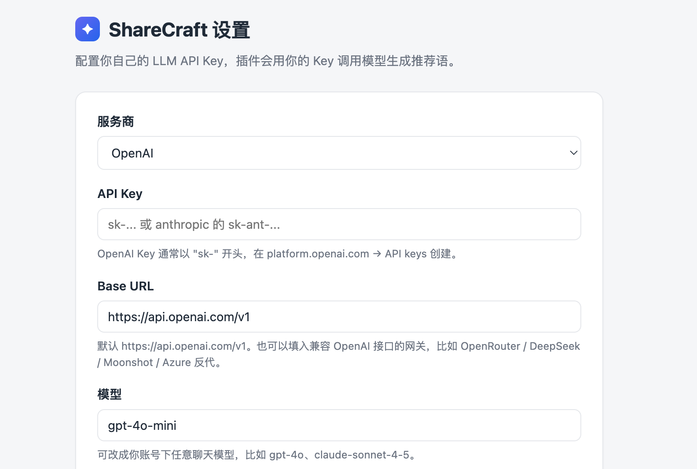
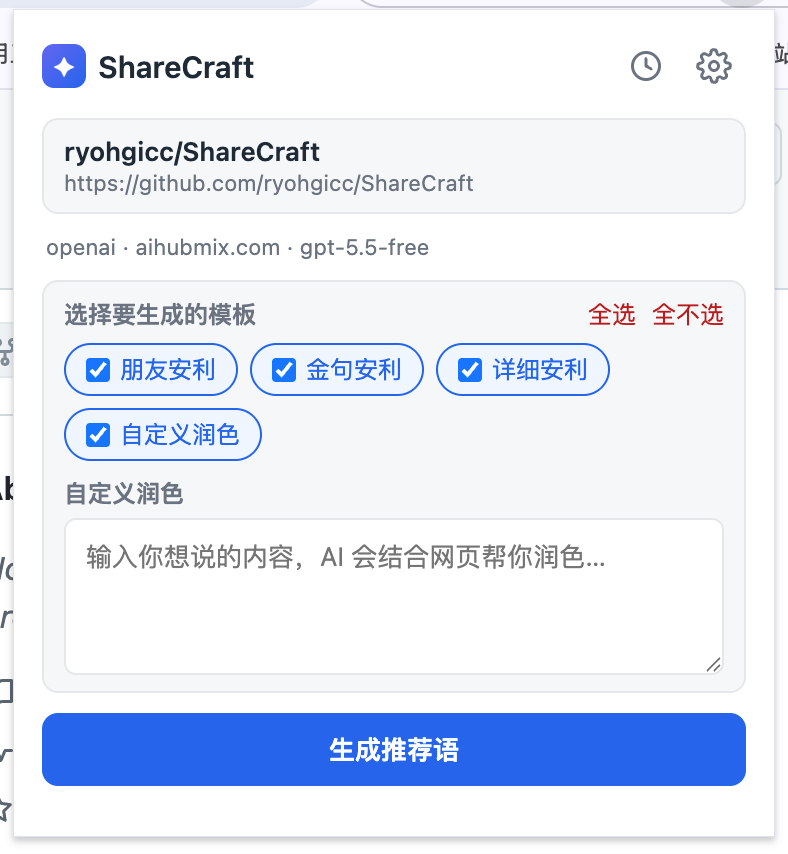
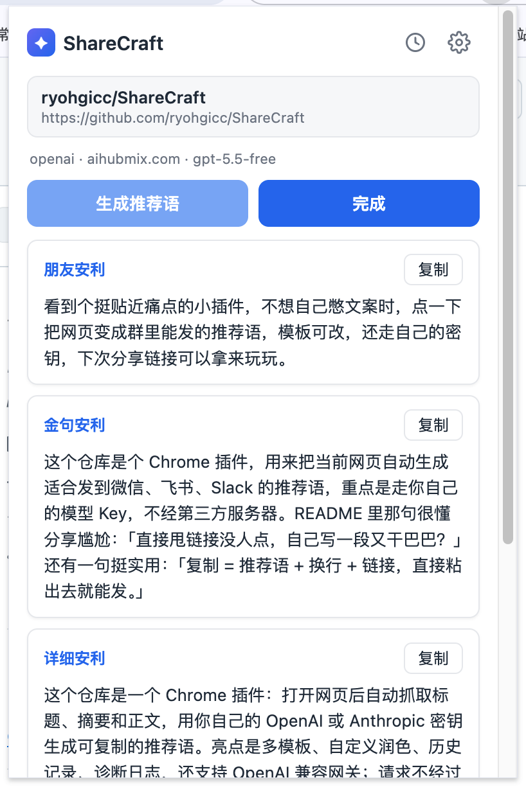

# ShareCraft

> 一键把任意网页变成可直接转发的推荐语。

每次想分享一个链接给朋友或群里，是不是都卡在"怎么写一句话让人想点开"？ShareCraft 帮你跳过这一步——打开任意网页，点一下插件图标，AI 自动读取页面内容，并发生成多条不同风格的推荐语，复制即用。



## 核心功能

**多模板并发生成**
内置 4 种预设模板（朋友安利 / 金句安利 / 详细安利 / 自定义润色），也可以自己新增。每个模板独立并发请求，总耗时 ≈ 最慢那一条。



**自定义润色**
勾选"自定义润色"模板后出现输入框，写一段你自己的点评，AI 结合网页内容帮你润色——保留你的观点和语气，只优化表达。

**一键复制**
每条推荐语旁边有复制按钮，点击自动拼接「推荐语 + 换行 + 链接」，直接粘到微信 / 飞书 / Slack / Discord 发出去。



**用你自己的 Key**
支持 OpenAI 和 Anthropic 协议（含兼容网关：DeepSeek / Moonshot / OpenRouter / 自建反代等）。API Key 只存在浏览器本地，不经过任何第三方服务器。

## 其他亮点

- **模板选择器**：生成前勾选想要的模板，只跑选中的
- **终止任务**：生成中随时可终止，已完成的部分保留
- **后台运行**：关掉 popup 窗口任务也会继续，下次打开自动恢复
- **历史记录**：自动保存每次生成结果（最多 100 条），支持搜索、复制、删除
- **输出语言锁定**：支持 8 种语言，无论原文是什么语言，输出和引用都强制翻译为目标语言
- **字符上限可调**：每个模板独立设置输出长度，模型会被引导写到上限的 80%-100%
- **Prompt 可编辑**：设置页可直接编辑每个模板的 prompt，支持实时预览完整提示词
- **诊断日志**：遇到问题可打开诊断日志查看每个请求的时间线和完整错误
- **新手引导**：首次使用有 4 步图文引导

## 安装

1. 下载或 clone 本仓库
2. 打开 `chrome://extensions`（Edge 是 `edge://extensions`）
3. 开启"开发者模式"
4. 点击"加载已解压的扩展程序"，选择仓库根目录

## 配置

1. 点击工具栏 ShareCraft 图标 → 右上角 ⚙ 进入设置页
2. 填入 API Key 和 Base URL
3. 点「测试连接」确认可用
4. 保存

支持的服务商 / 网关：
- OpenAI（`https://api.openai.com/v1`）
- Anthropic（`https://api.anthropic.com/v1`）
- 任何兼容 OpenAI 协议的网关（DeepSeek / Moonshot / OpenRouter / Azure 反代等）

## 使用

1. 打开任意你想分享的网页
2. 点击 ShareCraft 图标
3. 勾选要生成的模板
4. 点「生成推荐语」
5. 等几秒，选一条最喜欢的，点「复制」
6. 粘贴到聊天窗口发送

## 目录结构

```
sharecraft/
├── manifest.json           # Chrome MV3 配置
├── icons/                  # 扩展图标
├── onboarding/             # 新手引导配图
├── scripts/
│   └── make_icons.py       # 图标生成脚本
└── src/
    ├── background.js       # Service Worker，任务调度
    ├── extractor.js        # 页面内容抓取（注入脚本）
    ├── llm.js              # LLM 调用客户端
    ├── prompts.js          # 提示词定义（可编辑）
    ├── storage.js          # 设置存储
    ├── task.js             # 任务状态持久化
    ├── historyStore.js     # 历史记录存储
    ├── log.js              # 诊断日志
    ├── popup.*             # 弹窗 UI
    ├── options.*           # 设置页
    ├── history.*           # 历史记录页
    └── logs.*              # 诊断日志页
```

## 隐私

- API Key 存在 `chrome.storage.sync`，仅随你的 Chrome 账号同步，不上传第三方
- 请求直接发往你配置的 API 端点，没有中间服务器
- 页面内容只在本地处理和发送给你选择的 LLM 服务商
- 调用费用由你的 Key 账号承担

## 常见问题

**Q：浏览器内部页面（chrome:// / 新标签页）提示无法读取？**
A：Chrome 安全限制，内部页面禁止脚本注入。换一个普通网页即可。

**Q：生成失败 401 / 403？**
A：API Key 错误或无权限。去设置页确认 Key 和模型名。

**Q：某些网关报 400 错误？**
A：可能是网关不支持某些参数。插件已做了最大兼容（不发 `response_format`、不发 `max_tokens`），如果还报错请检查网关文档。

**Q：生成卡住不动？**
A：打开设置页底部的「诊断日志」查看具体哪个请求超时或失败。

## License

MIT

---

## 更新日志

### v2.1.0

- 新增「自定义（直接请求）」服务商选项：直接 POST 到用户填的完整 URL，不追加任何路径。适合 URL 本身就是完整端点的网关（如 PackyAPI）。
- OpenAI 选项现在明确标注为"OpenAI（兼容协议）"，会自动拼接 `/chat/completions`。
- 设置页 Base URL 提示文案更新，明确说明每种模式的 URL 填法。
- 修复 v2.0.2 中第三方网关 URL 处理逻辑不稳定的问题。

### v2.0.2

- 修复第三方网关 URL 被强制追加 `/chat/completions` 的问题。现在只有官方域名（`api.openai.com` / `api.anthropic.com`）会自动拼接路径，其他网关直接使用用户填写的完整 URL。
- 更新朋友安利默认 prompt（结构化 ending rule）。

### v2.0.1

- 修复测试连接时 `max_tokens` 参数导致新模型报 400 的问题
- 修复点完成后页面信息区未恢复当前网页标题的问题
- 修复新增内置模板不自动选中的问题
- 修复 `requiresInput` 标记升级丢失的问题
- 修复设置页"恢复默认模板"确认提示一直显示的 CSS bug
- 新手引导改为全屏遮罩 + 配图 + 按钮美化

### v2.0.0

- 模板系统从硬编码改为用户可自由增删的列表
- 每个模板独立并发请求
- 新增自定义润色模板（`requiresInput`）
- 新增模板选择器、终止任务、历史记录、诊断日志
- 新增 Base URL 设置，支持任意 OpenAI 兼容网关
- 新增全局语言锁定规则
- 新增新手引导
- 修复 patchTask 并发竞态导致结果丢失的 bug
- 新增 SW keepalive 心跳防止超时失效
